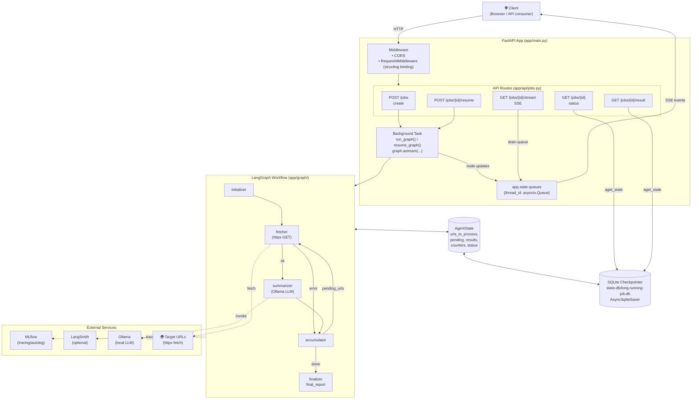

# System Architecture

## Overview Diagram

## Request Flow

1. **Create** — `POST /jobs` returns a `thread_id` and schedules `run_graph()` as a background task.
2. **Stream** — `GET /jobs/{id}/stream` (SSE) drains per-job updates from `app.state.queues` as nodes execute.
3. **Status** — `GET /jobs/{id}` reads the latest checkpoint from SQLite via `aget_state`.
4. **Result** — `GET /jobs/{id}/result` returns `final_report` once `job_status == "completed"`.
5. **Resume** — `POST /jobs/{id}/resume` rehydrates state from the checkpoint and continues the loop.

## Components

| Component | Responsibility |
| --- | --- |
| `app/main.py` | FastAPI entry point, lifespan, checkpointer init, MLflow setup, trace cleanup |
| `app/api/jobs.py` | REST + SSE routes; orchestrates background graph runs |
| `app/graph/agent.py` | Workflow definition (nodes + edges) |
| `app/graph/utils/nodes.py` | Node implementations: initializer, fetcher, summarizer, accumulator, finalizer |
| `app/graph/utils/routes.py` | Conditional routing logic between nodes |
| `app/graph/utils/state.py` | `AgentState` and `UrlResult` Pydantic models |
| `app/schemas/schema.py` | API request/response shapes |
| `app/middleware/` | `RequestIdMiddleware` for structlog context binding |
| `app/config.py` | Pydantic settings loaded from `.env` |
| `app/logging_config.py` | structlog configuration |

## State & Persistence

- **AgentState** holds `urls_to_process`, `pending_urls`, `completed_results`, counters, and `job_status`.
- **AsyncSqliteSaver** persists every checkpoint to `state-db/long-running-job.db`.
- `JsonPlusSerializer` is configured with `allowed_msgpack_modules=[("app.graph.utils.state", "UrlResult")]` so custom types survive serialization.
- **SSE queues** in `app.state.queues` are in-memory only — they reset on restart, but the graph state itself survives via the checkpointer.

## External Dependencies

- **FastAPI** — web framework
- **LangGraph** — workflow orchestration + checkpointing
- **LangChain / langchain-ollama** — LLM integration (local Ollama)
- **httpx** — async URL fetching
- **MLflow** — experiment & trace tracking
- **LangSmith** *(optional)* — additional tracing
- **structlog** — structured logging
- **Pydantic / pydantic-settings** — validation & config
